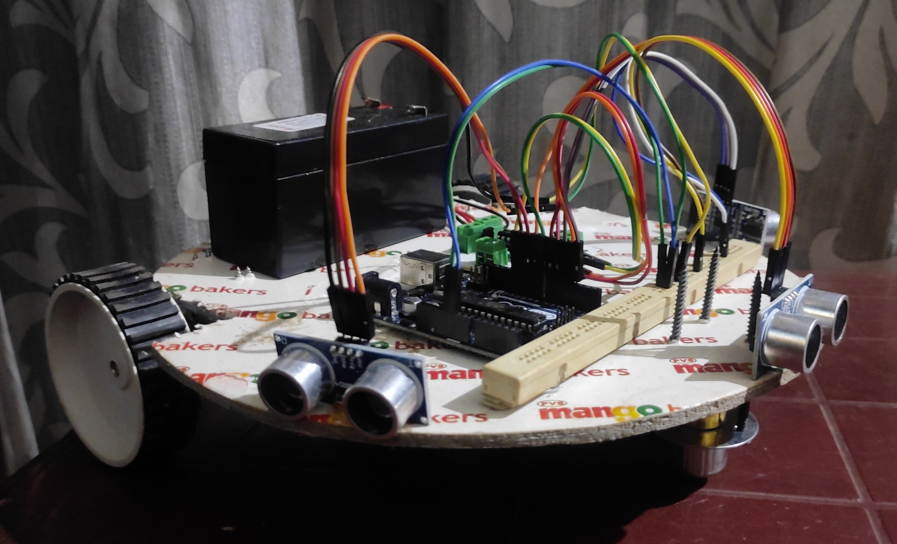
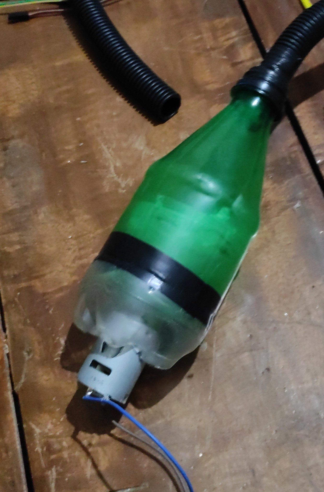
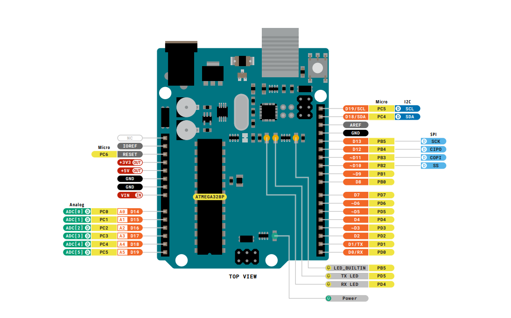
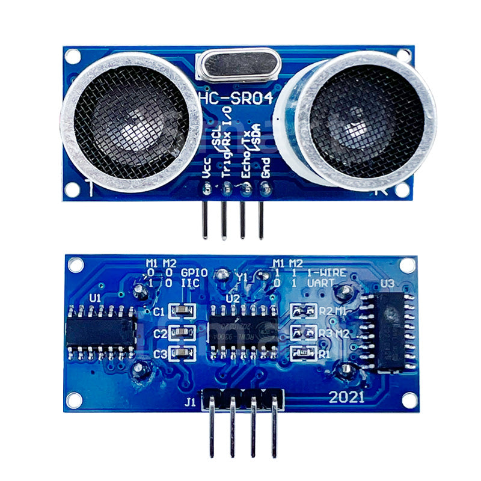
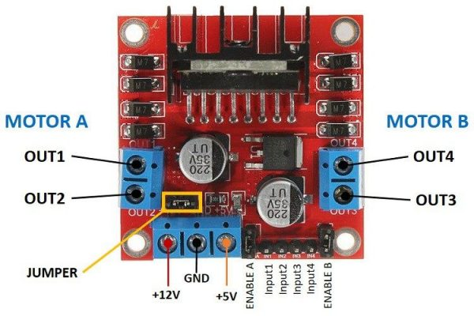

# Autonomous Vacuum Cleaner Robot

An autonomous floor-cleaning robot built with **Arduino UNO**, three **HC-SR04 ultrasonic sensors**, an **IR cliff sensor**, an **L298N motor driver**, and a **DIY suction assembly**. The robot navigates a room independently — detecting and avoiding obstacles in three directions, preventing itself from falling off edges, and continuously vacuuming the floor through a self-built suction mechanism.

> [!NOTE]
> Hardware project | Arduino IDE | C/C++ | Proteus simulation

---

## Demo
<table>
  <tr>
    <td align="center"></td>
    <td align="center"></td>
    <td align="center"></td>
  </tr>
</table>

---

## Features

- Autonomous forward navigation with no manual input
- Three-direction obstacle detection (left, front, right) using HC-SR04 sensors
- Cliff / floor-edge detection using IR sensor to prevent falls
- Smart turning logic based on which direction is blocked
- Post-cliff recovery: auto-reverses and turns away from edge
- **Continuous DIY suction system** running independently from robot navigation
- Serial Monitor debug output for real-time sensor readings
- Proteus simulation validated before hardware build

---

## Hardware Components

### Navigation & Control

| Component | Quantity |
|---|---|
| Arduino UNO | 1 |
| HC-SR04 Ultrasonic Sensor | 3 |
| IR Cliff / Floor Detection Sensor | 1 |
| L298N Dual H-Bridge Motor Driver | 1 |
| DC Motor (with wheels) | 2 |
| Robot Chassis | 1 |
| Battery Pack (12V) | 1 |
| Jumper Wires | — |

### DIY Suction Assembly

| Component | Purpose |
|---|---|
| DC Motor (high RPM) | Creates suction airflow |
| Plastic Bottle | Dust collection chamber |
| Hollow Pipe / Tube | Floor intake nozzle |
| 12V Battery Pack | Powers entire robot including suction motor |

---

## System Architecture

The robot runs two independent subsystems from a single **12V battery**:

```
12V Battery
├── → Arduino UNO (via L298N onboard 5V regulator)
│       └── Controls: Ultrasonic sensors, IR sensor, Drive motors
│
└── → Suction DC Motor (direct connection, always ON when powered)
        └── Drives: Bottle chamber + pipe intake nozzle
```

> The suction motor is not controlled by Arduino — it runs continuously whenever the robot is powered. This keeps the wiring simple and ensures the floor is always being cleaned while the robot navigates.

---

## DIY Suction Mechanism

The suction system is built entirely from repurposed parts:



- A **high-RPM DC motor** spins a fan/impeller inside a sealed **plastic bottle**, creating negative pressure (suction)
- A **hollow pipe or tube** connects the bottle inlet to a floor-level nozzle at the front of the chassis
- Dust and debris are drawn up through the pipe and collected inside the bottle chamber
- The bottle cap or a cut opening serves as the **exhaust vent**

> [!TIP]
> The suction intake pipe should be mounted as close to the floor surface as possible — within 3–5 mm — for effective debris pickup. Too large a gap significantly reduces suction efficiency.

---

## Block Diagram


---

## Pin Configuration

### Arduino UNO R3



### Ultrasonic Sensors (HC-SR04)



| Sensor | Trig Pin | Echo Pin |
|---|---|---|
| Left | 3 | 5 |
| Front | 6 | 9 |
| Right | 10 | 11 |

### IR Floor Sensor


| Signal | Arduino Pin |
|---|---|
| IR Output | 2 |

> [!NOTE]
> IR reads `LOW` = floor present, `HIGH` = edge/cliff detected

### Motor Driver (L298N)



| Motor | IN1 | IN2 |
|---|---|---|
| Motor 1 (Left wheel) | 4 | 7 |
| Motor 2 (Right wheel) | 8 | 12 |

### Suction Motor

| Connection | Detail |
|---|---|
| Power | Direct from 12V battery (no Arduino pin) |
| Control | Always ON when robot is powered |

---

## Navigation Logic

The robot follows a priority-based decision tree every 50 ms:

```
1. Cliff detected?       → Reverse 700ms, set recovery flag
2. Recovery flag set?    → Turn left 100ms, clear flag
3. All directions clear? → Move forward
4. Left blocked only?    → Turn right
5. Right blocked?        → Turn left
6. Front blocked?        → Turn left (default escape)
```

**Obstacle threshold:** 15 cm (configurable via `OBSTACLE_THRESHOLD_CM` constant in the sketch)

---

## How to Build and Flash

1. Wire all navigation components according to the pin configuration tables above
2. Connect the suction DC motor directly to the 12V battery (independent of Arduino)
3. Mount the pipe intake nozzle at the front-bottom of the chassis, 3–5 mm above floor level
4. Open `Vacuum_cleaner/Vacuum_cleaner.ino` in **Arduino IDE**
5. Select **Board:** Arduino UNO and the correct **COM Port**
6. Upload the sketch
7. Open **Serial Monitor** at `9600 baud` to watch live sensor readings
8. Power the robot from the battery pack and place it on the floor

---

## How It Works

### Ultrasonic Sensors (HC-SR04)
Each sensor sends a 10 µs HIGH pulse on its trigger pin, which fires an ultrasonic burst. The echo pin goes HIGH for a duration proportional to the round-trip travel time of the sound wave. The firmware converts this to centimetres:

```
distance (cm) = pulse_duration_µs × 0.034 / 2
```

Three sensors give the robot a 180° field of awareness — left, front, and right — so it can choose the best escape direction when blocked.

### IR Cliff Sensor
The IR sensor points downward and detects whether the floor is present beneath the robot. If the floor disappears (staircase, table edge), the sensor output goes HIGH and the robot immediately reverses before re-orienting.

### Motor Control (L298N)
The L298N H-bridge allows independent direction control of both DC motors. Turning is achieved by running one motor forward and one backward, creating an in-place pivot.

### DIY Suction System
The suction motor runs directly off the 12V supply — no relay or Arduino control needed. As long as the robot is powered, the suction is active. The plastic bottle acts as a sealed collection chamber; debris drawn in through the floor pipe settles inside while air exits through the exhaust vent.

---

## Known Limitations

> [!CAUTION]
> The robot cannot detect low-profile obstacles (e.g., a cable or shoe lying flat) as the ultrasonic sensors are mounted horizontally above floor level.

- No PWM speed control — drive motors run at full speed only
- Fixed 15 cm obstacle threshold may need tuning for different environments
- No memory of previously visited areas (no systematic coverage pattern)
- Suction motor runs continuously — no power saving when robot is turning or reversing

---

## Potential Improvements

- Control suction motor via Arduino relay — turn off during reversals to save power
- Add PWM speed control via `analogWrite()` for smoother turning
- Implement a systematic coverage pattern (e.g., boustrophedon / lawn-mower path)
- Add a gyroscope (MPU6050) for more accurate turning angles
- Log sensor data over Bluetooth for path analysis
- Replace bottle chamber with a proper filter bag for finer dust collection

---

## Tools Used

| Tool | Purpose |
|---|---|
| Arduino IDE | Firmware development |
| Proteus | Circuit simulation before hardware build |
| Serial Monitor | Real-time sensor debugging |

---

## Author

**Amarnath K R**  
[GitHub](https://github.com/kramarnath)
